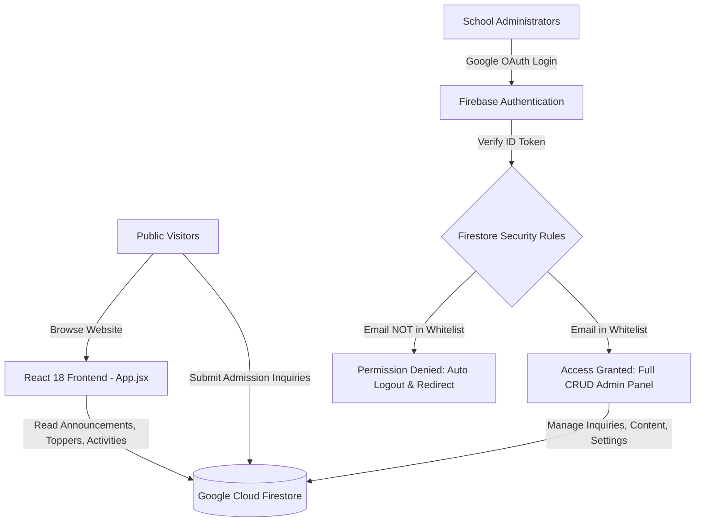
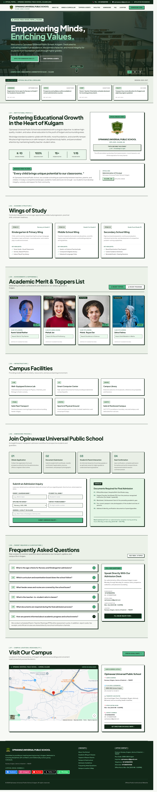

# 🏫 Opinawaz Universal Public School — Official Web Platform & Admin Portal

[](https://opinawaz.netlify.app/)
[](https://reactjs.org/)
[](https://vitejs.dev/)
[](https://firebase.google.com/)
[](https://tailwindcss.com/)
[](LICENSE)

> **Official web portal and real-time cloud administrative management system for Opinawaz Universal Public School, located in Karewa, Kulgam, Jammu & Kashmir (PIN: 192231).**  
> 🔗 **Live Website**: [https://opinawaz.netlify.app/](https://opinawaz.netlify.app/)  
> 📸 **Full Page Screenshot**: [Jump to Website Preview at Bottom ↓](#website-preview)

---

## 📌 Table of Contents

- [Overview](#-overview)
- [Design Language & Aesthetics](#-design-language--aesthetics)
- [Key Features](#-key-features)
  - [Public Website Experience](#1-public-website-experience)
  - [Administrative Management Console](#2-administrative-management-console)
- [System Architecture & Security](#-system-architecture--security)
- [Tech Stack](#-tech-stack)
- [Project Directory Structure](#-project-directory-structure)
- [Getting Started](#-getting-started)
  - [Prerequisites](#prerequisites)
  - [Installation & Setup](#installation--setup)
  - [Environment Variables Configuration](#environment-variables-configuration)
- [Firebase Cloud Firestore Setup](#-firebase-cloud-firestore-setup)
  - [Security Rules & Whitelist](#firestore-security-rules)
  - [Authorizing Admin Emails](#authorizing-new-admin-emails)
- [Admin Portal Access Guide](#-admin-portal-access-guide)
- [Institutional Contacts & Location](#-institutional-contacts--location)
- [📸 Full Website Preview & Screenshot](#website-preview)
- [License](#-license)

---

## 🌟 Overview

**Opinawaz Universal Public School (opnawaz-neobrutalweb)** is a modern, full-featured institutional web application tailored to the operational and communicative needs of a premier educational institution in South Kashmir.

- **Official Live Website**: [https://opinawaz.netlify.app/](https://opinawaz.netlify.app/)
- **Campus Location**: Karewa, Kulgam, Jammu & Kashmir — 192231

The application serves two primary roles:
1. **Public Web Experience**: A clean, accessible, and fast-loading portal where parents, prospective students, and community members can explore academic wings, view board examination toppers, browse campus activities through photo galleries, submit admission inquiries, read circulars, and access school credentials.
2. **Restricted Administrative Console**: An authenticated dashboard where school administrators can manage admission leads (CRM), broadcast emergency announcements, publish notices, curate the student merit hall (with live face-crop/focal-point centering), upload school event galleries, configure FAQs, and update official contact channels in real time.

---

## 🎨 Design Language & Aesthetics

The web platform features an opinionated **Neo-Brutalist** design system designed to convey institutional solidity, clarity, and bold modernism:

- **Earthy Institutional Palette**: Deep forest green (`#122818`), emerald sage (`#52B788`), pale mint (`#D8F3DC`), and crisp off-white (`#F7F9F5`), accented with warning crimsons and high-visibility badges.
- **Bold Geometry & Tactile Shadows**: High-contrast `2px`–`4px` solid dark borders with hard drop shadows (`shadow-[4px_4px_0px_#122818]`), interactive translate-on-hover actions, and tactile feedback.
- **Editorial Typography**: Pairing Google Fonts **Plus Jakarta Sans** for readable body content and **Space Grotesk** / **Space Mono** for crisp, monospaced architectural accents and badges.
- **Micro-Interactions**: Smooth scrolling, image lightbox transitions with keyboard navigation, dynamic alert strips, and real-time live indicator pings.

---

## 🚀 Key Features

### 1. Public Website Experience

- **🚨 Live Emergency Broadcast Strip**: Dismissible alert banner for urgent announcements (weather advisories, holiday updates, counter hours).
- **🖼️ Dynamic Hero Carousel**: Auto-rotating slideshow with curated campus photography, captions, and sequential slide indicators.
- **📢 Real-Time Notice Board**: Live circulars and announcements categorized by tag (Admission, Notice, Event, Facility) with instant Firestore updates.
- **📚 Academic Wings & Curriculum**: Interactive breakdown of education stages:
  - *Kindergarten & Primary Wing* (Nursery to Grade 5)
  - *Middle School Wing* (Grade 6 to Grade 8)
  - *Secondary School Wing* (Grade 9 & Grade 10 JKBOSE preparation)
- **🏆 Hall of Excellence (Toppers & Merit Showcase)**:
  - District rankers and merit students with score tags and distinction medals.
  - Smart image rendering with focal-point centering so student portraits are never awkwardly cropped across cards.
- **📸 School Activities & Multi-Photo Lightbox**:
  - Highlights annual sports meets, science exhibitions, cultural conferences, and symposiums.
  - Interactive popup modal lightbox featuring photo carousels, caption overlays, and full keyboard navigation (`ArrowRight`, `ArrowLeft`, `Escape`).
- **🏫 Campus Infrastructure & Facilities**: Overview of practical Science Labs, Smart Computer Center, Central Library, Monitored Bus Fleet, and Sports Grounds.
- **📝 4-Step Interactive Admissions Guide**: Clear roadmap from prospectus collection, document submission, informal interaction, to seat confirmation.
- **📩 Online Admission Inquiry Form**: Instant registration form allowing prospective parents to submit leads directly into the school's Firestore inquiry database.
- **❓ Interactive FAQ Accordion**: Expandable answers to common parental questions (age criteria, JKBOSE affiliation, bus routes, student-teacher ratios).
- **📍 Contact & Social Hub**: Direct phone dial links, WhatsApp integration, location details for Karewa, Kulgam, school operational hours, and social media handles.

---

### 2. Administrative Management Console

Accessible via `/#admin` (e.g. [opinawaz.netlify.app/#admin](https://opinawaz.netlify.app/#admin)) or through a secret 7-click trigger on the copyright footer, the Admin Console provides full administrative control:

| Tab | Feature | Description |
|---|---|---|
| 📋 **Leads & Inquiries** | **Admissions CRM** | Search, filter, and track prospective student inquiries. Update inquiry status (`Pending`, `Contacted`, `Approved`, `Rejected`), delete records, or export entire lead lists into CSV spreadsheets. |
| 📢 **Notices & Circulars** | **Notice Publisher** | Publish date-stamped announcements with tags (`ADMISSION`, `NOTICE`, `EVENT`, `FACILITY`) directly to the public live ticker. |
| ★ **Toppers Studio** | **Merit Hall & Face Crop** | Add toppers with score, rank, and badge. Includes a built-in **Face Crop Studio** with horizontal pan (`focalX`), vertical pan (`focalY`), and zoom controls to perfectly frame student headshots. |
| 🗓 **Activities Manager** | **Event Gallery Studio** | Create events with multi-photo galleries, choose cover images, categorize events, and reorder them with up/down arrows. |
| 💬 **Website FAQs** | **Knowledgebase Editor** | Add, edit, reorder, and preview school FAQs with live question-answer previews before publishing. |
| 🚨 **Emergency Strip** | **Urgent Broadcasts** | Toggle the top emergency banner on or off and update its broadcast message across the entire website instantly. |
| 🏢 **Contact & Socials** | **School Directory** | Update main phone number, alternate phone, official email, physical campus address, office hours, and social profile links (WhatsApp, Facebook, Instagram, YouTube, Twitter). |
| 🖼️ **Hero Slideshow** | **Hero Carousel Studio** | Add new slides with custom labels and image URLs, reorder slide sequence, select from pre-configured campus presets, or reset to defaults. |
| ☁️ **Cloud Seeder** | **One-Click Firestore Seed** | Initialize or restore standard institutional data directly to Google Cloud Firestore with a single click. |

---

## 🛡️ System Architecture & Security



### Key Security Principles:
1. **Zero Client-Side Email Exposure**: No administrative email addresses or credentials are coded into the frontend JavaScript bundle.
2. **Database-Level Enforcement**: Authorization is strictly enforced at the Google Cloud Firestore rule level (`isAuthorizedAdmin()`). Even if an unauthorized user attempts to manipulate frontend state, all Firestore read/write operations fail with `permission-denied`.
3. **Automatic Ejection Guard**: Any Google account signed in that does not possess administrative privileges in Firestore is immediately signed out and redirected back to the public homepage.
4. **Dual Mode Resilience**: If Firebase credentials are not provided or the network is offline, the application seamlessly falls back to `localStorage` mode so that local previewing and testing remain functional.

---

## 💻 Tech Stack

| Domain | Technology | Purpose |
|---|---|---|
| **Framework** | [React 18](https://react.dev/) | Component architecture, state management (`useState`, `useEffect`) |
| **Bundler & Dev Server** | [Vite 5](https://vitejs.dev/) | Instant Hot Module Replacement (HMR) and optimized production builds |
| **Styling** | [Tailwind CSS](https://tailwindcss.com/) + Vanilla CSS | High-contrast Neo-Brutalist design tokens, utility classes, responsiveness |
| **Database** | [Google Cloud Firestore](https://firebase.google.com/docs/firestore) | Real-time database listeners (`onSnapshot`) for notices, inquiries, toppers, and settings |
| **Authentication** | [Firebase Auth](https://firebase.google.com/docs/auth) | Google OAuth popup authentication with institutional account verification |
| **Hosting & Deployment** | [Netlify](https://www.netlify.com/) | Continuous deployment, automated builds, CDN edge distribution |
| **Icons & Media** | SVG + Custom Assets | SVG icons, optimized institutional crests, and dynamic Unsplash fallback photography |
| **Typography** | Google Fonts | Plus Jakarta Sans, Space Grotesk, Space Mono |

---

## 📁 Project Directory Structure

```
opnawaz neobrutalweb/
├── public/
│   └── favicon.svg                                                # Custom Neo-Brutalist browser favicon
├── src/
│   ├── assets/
│   │   ├── nobglogo.png                                           # Transparent high-resolution school logo
│   │   ├── opnawazlogo.jpeg                                       # Official school crest / insignia
│   │   └── screencapture-opinawaz-netlify-app-2026-09-05-14_34_13.png # Full live site screenshot preview
│   ├── AdminPanel.jsx                                             # Full administrative console (CRM, Toppers, Notices, FAQs)
│   ├── App.jsx                                                    # Main public website component & router
│   ├── App.css                                                    # Application-specific layouts & transitions
│   ├── firebase.js                                                # Modular Firebase 10 SDK integration, Firestore CRUD & Auth
│   ├── imageHelper.js                                             # Universal focal point (focalX/focalY/zoom) crop math
│   ├── index.css                                                  # Global CSS reset & typography classes
│   └── main.jsx                                                   # React root mounting script
├── .env.example                                                   # Template for Firebase environment credentials
├── FIREBASE_SECURITY_RULES_SETUP.md                               # In-depth guide on Firestore security rules & admin whitelisting
├── index.html                                                     # Application shell, font imports & Tailwind config
├── package.json                                                   # Node dependencies & npm scripts
├── vite.config.js                                                 # Vite build configuration
└── README.md                                                      # Comprehensive project documentation
```

---

## ⚡ Getting Started

### Prerequisites

- **Node.js**: Version `18.x` or higher recommended ([Download Node.js](https://nodejs.org/)).
- **npm**: Version `9.x` or higher.
- A **Google Firebase Project** with Firestore and Authentication enabled (for cloud sync features).

---

### Installation & Setup

1. **Clone the repository**:
   ```bash
   git clone https://github.com/your-org/opnawaz-neobrutalweb.git
   cd opnawaz-neobrutalweb
   ```

2. **Install project dependencies**:
   ```bash
   npm install
   ```

3. **Configure environment variables**:
   ```bash
   cp .env.example .env
   ```
   Open `.env` and enter your Firebase project credentials (see below).

4. **Start the local development server**:
   ```bash
   npm run dev
   ```
   Open `http://localhost:3000` (or the port specified in terminal) in your browser.

5. **Build for production**:
   ```bash
   npm run build
   ```
   The production-ready artifacts will be compiled into the `dist/` directory.

---

### Environment Variables Configuration

Create a `.env` file in the project root with the following variables obtained from your [Firebase Console](https://console.firebase.google.com/):

```ini
# Google Firebase Configuration
VITE_FIREBASE_API_KEY=AIzaSy...
VITE_FIREBASE_AUTH_DOMAIN=your-school-id.firebaseapp.com
VITE_FIREBASE_PROJECT_ID=your-school-id
VITE_FIREBASE_STORAGE_BUCKET=your-school-id.firebasestorage.app
VITE_FIREBASE_MESSAGING_SENDER_ID=1234567890
VITE_FIREBASE_APP_ID=1:1234567890:web:abcdef123456
VITE_FIREBASE_MEASUREMENT_ID=G-XXXXXXXXXX
```

> [!NOTE]
> If you run the project without `.env` credentials, it will automatically operate in **Local Mode** using browser `localStorage` and pre-populated institutional mock data.

---

## 🔥 Firebase Cloud Firestore Setup

### Firestore Security Rules

To ensure public visitors can view content and submit inquiries, while only authorized school personnel can read inquiries or edit content, apply these rules in your **Firebase Console → Firestore Database → Rules**:

```javascript
rules_version = '2';
service cloud.firestore {
  match /databases/{database}/documents {
    
    // =========================================================================
    // 🔑 AUTHORIZED ADMINISTRATOR WHITELIST
    // =========================================================================
    function isAuthorizedAdmin() {
      return request.auth != null && 
             request.auth.token.email in [
               "principal@opnawaz.edu",
               "admin@opnawaz.edu",
               "mohsinnawaz9541@gmail.com"
               // Add new authorized institutional emails here
             ];
    }

    // Admission Leads / Inquiries:
    // Anyone on public website can submit leads; only authorized admins can read or manage
    match /inquiries/{docId} {
      allow create: if true;
      allow read, update, delete: if isAuthorizedAdmin();
    }

    // Public Website Content:
    // Public visitors can read; only authorized admins can create, update, or delete
    match /announcements/{docId} {
      allow read: if true;
      allow write: if isAuthorizedAdmin();
    }
    match /toppers/{docId} {
      allow read: if true;
      allow write: if isAuthorizedAdmin();
    }
    match /activities/{docId} {
      allow read: if true;
      allow write: if isAuthorizedAdmin();
    }
    match /faqs/{docId} {
      allow read: if true;
      allow write: if isAuthorizedAdmin();
    }
    match /settings/{docId} {
      allow read: if true;
      allow write: if isAuthorizedAdmin();
    }
    match /heroSlides/{docId} {
      allow read: if true;
      allow write: if isAuthorizedAdmin();
    }
  }
}
```

### Authorizing New Admin Emails

1. Open [Firebase Console → Firestore Database → Rules](https://console.firebase.google.com/).
2. Locate the `isAuthorizedAdmin()` function.
3. Add the new email address inside the array:
   ```javascript
   request.auth.token.email in [
     "admin@opnawaz.edu",
     "new_faculty_member@gmail.com"
   ];
   ```
4. Click **Publish**. The user can now immediately log in without requiring any code deployment.

For detailed security troubleshooting, see [`FIREBASE_SECURITY_RULES_SETUP.md`](./FIREBASE_SECURITY_RULES_SETUP.md).

---

## 🔑 Admin Portal Access Guide

There are two easy methods to enter the Administration Portal:

1. **Direct Navigation**: Navigate to [https://opinawaz.netlify.app/#admin](https://opinawaz.netlify.app/#admin) or `/#admin` in your browser address bar.
2. **Secret Institutional Trigger**: On the public homepage, scroll down to the bottom footer and click the copyright text (*"Opinawaz Universal Public School. All rights reserved."*) **7 times consecutively**.

Once on the sign-in screen, click **Continue with Google** and authenticate using an authorized Google email address.

---

## 📞 Institutional Contacts & Location

- **Institution**: Opinawaz Universal Public School
- **Official Website**: [https://opinawaz.netlify.app/](https://opinawaz.netlify.app/)
- **Location**: Karewa, Kulgam, Jammu & Kashmir — 192231
- **Telephone**: `+91 94190 28723` / `+91 1931 260000`
- **Email**: `opnawazschool@gmail.com`
- **Office Timings**: Monday – Saturday (9:00 AM – 3:30 PM)

---

<a id="website-preview"></a>
## 📸 Full Website Preview & Screenshot

> 🚀 **Live Production Website**: **[https://opinawaz.netlify.app/](https://opinawaz.netlify.app/)**  
> *(Click anywhere on the full-page screenshot below to open the live site in a new tab)*

<p align="center">
  <a href="https://opinawaz.netlify.app/" target="_blank" rel="noopener noreferrer">
    
  </a>
</p>

<p align="center">
  <a href="https://opinawaz.netlify.app/" target="_blank" rel="noopener noreferrer">
    <strong>👉 Click here to visit the live site: https://opinawaz.netlify.app/ 👈</strong>
  </a>
</p>

<p align="center">
  <a href="#-table-of-contents"><strong>↑ Back to Top / Table of Contents</strong></a>
</p>

---

## 📄 License

This software and institutional design system are proprietary and developed specifically for **Opinawaz Universal Public School, Kulgam**. All rights reserved. Unauthorized reproduction or commercial distribution is prohibited.
